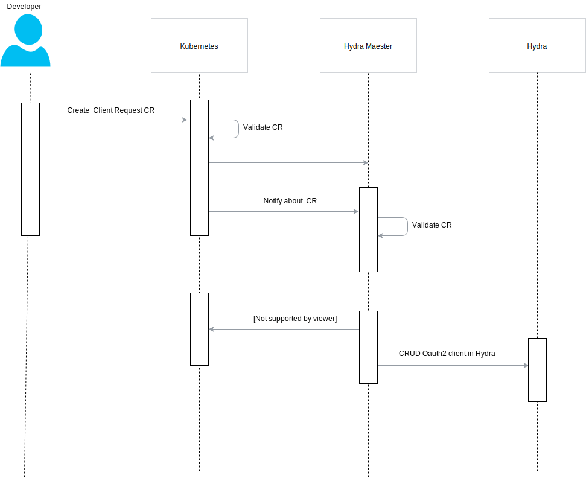
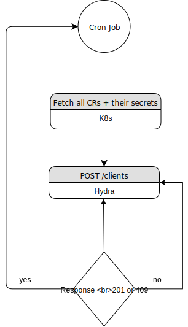

# Design

## Controller design

The controller listens for Custom Resource which defines client registration
request. Once Custom resource is created, the controller register oauth2 client
in hydra using hydra's REST API. Client Id, Client Secret and Identifier of the
client in hydra are be stored in the kubernetes as a secret and referenced in
the applied CR. Reference is used to identify in which kubernetes secret are
stored mentioned properties. Secret iscreated in the same namespace of applied
CR. By default controller should be deployed in the same pod as hydra. Service
discovery will come in place in the future.

Custom Resource should be Namespace scoped to enable isolation in k8s. It is
represented in the diagram

## Synchronization mode

Additionally, controller supports synchronization mode, where it tries to
register all clients in hydra. Synchronization is an optional mode, enabled via
config, which is meant for use cases where hydra is deployed with in memory
storage. If hydra pod is restarted for some reason then it does not have client
in its storage. With synchronization mode the controller makes sure that hydra
has up to date clients. Synchronization is done by making POST request to hydra
with payload describing all client information including clientID,clientSecret
and Identifier of last applied client. If client exists in hydra storage 409 is
returned which is considered as ok and synchronization continues with other
clients.

